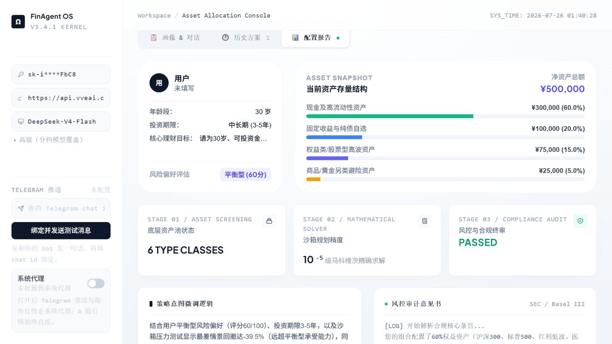
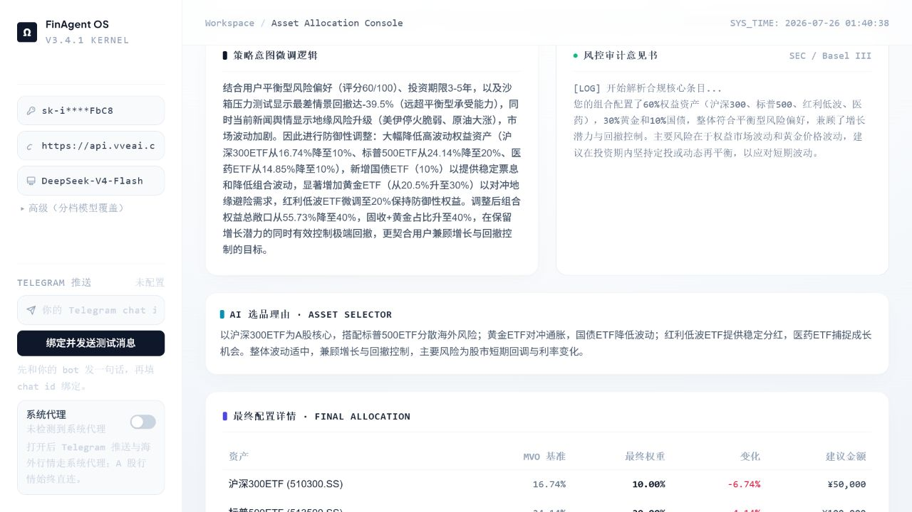
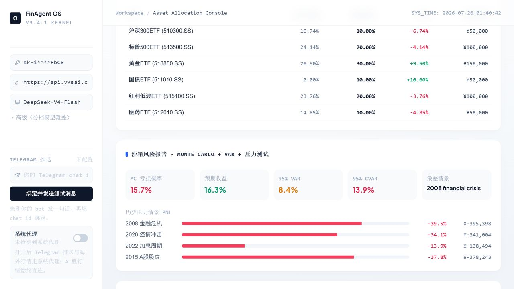
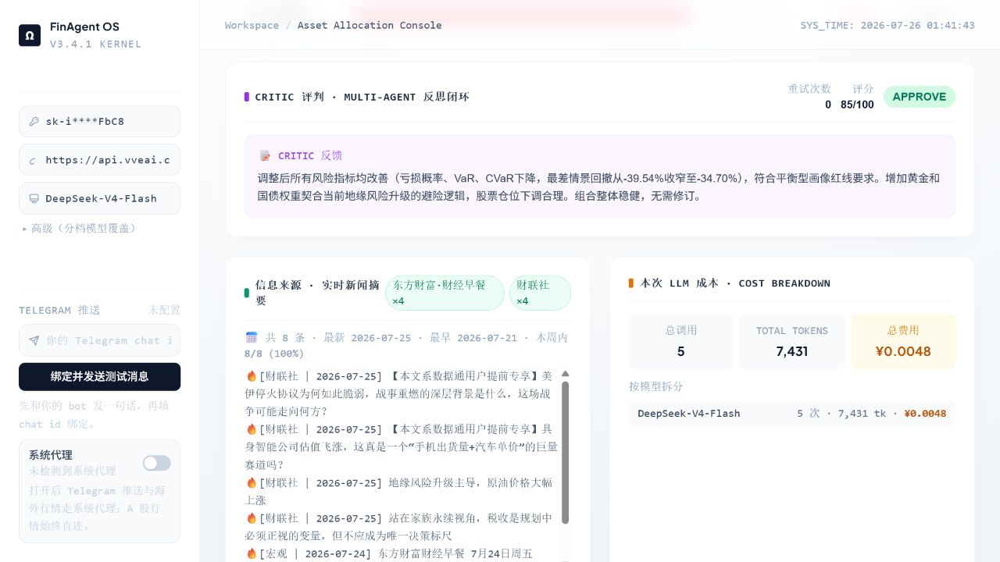

# FinAgent OS

FinAgent OS 是一个面向资产配置研究的多 Agent 应用。它将自然语言理解与确定性计算分开：LLM 负责意图路由、资产筛选、组合解释和风控审查，数值模块负责组合优化、回测、蒙特卡洛模拟、VaR/CVaR 与压力测试。

> 本项目用于研究和演示，不构成投资建议。真实部署前请补充身份认证、访问控制、密钥托管和数据合规方案。

## 主要功能

- 多 Agent 工作流：闲聊/问答、持仓体检、资产配置三条分支
- 资产配置：54 个候选标的、9 类资产、五档风险偏好与多种优化模型
- 风险分析：Monte Carlo、VaR/CVaR、压力情景、硬性权重门禁
- 数据能力：AkShare 与 yfinance 行情、多源新闻、宏观择时、动量因子
- 持久会话：用户、对话、方案快照、风险评估与历史召回
- 复盘能力：区间回测、业绩归因、调仓标记与待处理建议
- 可选通知：Telegram 绑定、单次推送和每周复盘任务
- 可配置 LLM：DeepSeek 默认配置，也支持 OpenAI 兼容接口与自定义模型 ID

## 项目结构

```text
FinAgentOS/
├─ fin_asset_agent/
│  ├─ main_api.py          # FastAPI 与 API 路由
│  ├─ index.html           # 唯一的运行时 Web 前端
│  ├─ core_brain/          # 工作流、路由与 Agent
│  ├─ sandbox/             # 优化、回测与可视化
│  ├─ data_ops/            # 行情、新闻、RAG、归因与通知
│  ├─ memory/              # SQLite/SQLAlchemy 状态与模型
│  ├─ skills/              # 可调度的数据技能
│  └─ tests/               # 自动化测试
├─ .github/workflows/ci.yml
├─ Dockerfile
└─ requirements.txt
```

运行时页面是 `fin_asset_agent/index.html`，由 FastAPI 的 `/` 路径直接提供。

## 运行效果

### 配置报告



### 资产配置



### 风险分析



### Agent 复核与模型成本



## 本地运行（隔离 Python 环境）

要求 Python 3.10+。不要把依赖安装到系统 Python；在仓库根目录创建项目专用虚拟环境。

### Windows PowerShell

```powershell
python -m venv .venv
.\.venv\Scripts\python.exe -m pip install --upgrade pip
.\.venv\Scripts\python.exe -m pip install -r requirements.txt
Copy-Item fin_asset_agent\config.example.yaml fin_asset_agent\config.yaml
Set-Location fin_asset_agent
..\.venv\Scripts\python.exe -m uvicorn main_api:app --host 127.0.0.1 --port 8000
```

### macOS / Linux

```bash
python3 -m venv .venv
./.venv/bin/python -m pip install --upgrade pip
./.venv/bin/python -m pip install -r requirements.txt
cp fin_asset_agent/config.example.yaml fin_asset_agent/config.yaml
cd fin_asset_agent
../.venv/bin/python -m uvicorn main_api:app --host 127.0.0.1 --port 8000
```

打开 <http://127.0.0.1:8000>。健康检查地址为 <http://127.0.0.1:8000/api/health>。

未配置 LLM Key 时，页面、健康检查、身份初始化、资产分类和大部分本地功能仍可用于验收；生成真实策略需要在页面中填写兼容服务的 API Key。

## 配置

复制 `fin_asset_agent/config.example.yaml` 为 `fin_asset_agent/config.yaml`，按需填写：

```yaml
llm:
  api_key: ""
  base_url: ""
  model: ""
  router_model: ""
  chat_model: ""
  primary_model: ""

telegram:
  bot_token: ""
  chat_id: ""
```

- `config.yaml` 已加入 `.gitignore`，不要提交真实密钥。
- LLM 配置也可在页面中填写；空值回退到默认配置。
- Telegram 可通过 `TELEGRAM_BOT_TOKEN`、`TELEGRAM_CHAT_ID` 环境变量配置。
- SQLite 默认写入 `fin_asset_agent/memory/finagent.db`。
- 行情缓存默认写入 `fin_asset_agent/data_ops/cache/`。

## 测试

测试使用 mock，不要求真实 LLM Key：

```powershell
Set-Location fin_asset_agent
..\.venv\Scripts\python.exe -m pytest tests -q
```

macOS/Linux 将解释器路径替换为 `../.venv/bin/python`。

当前测试基线：`269 passed`。

## Docker 部署

构建镜像：

```bash
docker build -t finagent-os .
```

启动：

```bash
docker run --rm -p 8000:8000 --name finagent-os finagent-os
```

如需持久化配置与 SQLite 数据：

```bash
docker run --rm -p 8000:8000 --name finagent-os \
  -v "$PWD/fin_asset_agent/config.yaml:/app/fin_asset_agent/config.yaml:ro" \
  -v "$PWD/runtime-data:/app/fin_asset_agent/memory" \
  finagent-os
```

生产部署建议：

- 将容器置于 HTTPS 反向代理之后，仅开放必要端口。
- 使用平台 Secret 管理或只读挂载注入密钥，不把 `config.yaml` 烘焙进镜像。
- 为 SQLite 目录配置持久卷；多实例部署时改用外部数据库。
- 当前 CORS 为宽松配置、接口无登录鉴权，面向公网前必须收紧。
- 使用 `/api/health` 作为存活探针。

## 常用 API

| 方法 | 路径 | 用途 |
|---|---|---|
| GET | `/api/health` | 服务健康检查 |
| GET | `/api/config` | 前端默认配置 |
| GET | `/api/categories` | 资产类别与数量 |
| POST | `/api/auth/init` | 初始化用户与会话 |
| POST | `/api/chat` | 持久多轮对话 |
| POST | `/api/allocate` | 一次性资产配置 |
| GET | `/api/sessions/{uuid}/snapshots` | 历史方案 |
| GET | `/api/sessions/{uuid}/attribution/{id}` | 业绩归因 |
| GET | `/api/sessions/{uuid}/backtest/{id}` | 区间回测 |
| POST | `/api/cron/weekly-review` | 手动触发复盘任务 |

完整路由及请求模型以 [`fin_asset_agent/main_api.py`](fin_asset_agent/main_api.py) 为准。

## CI

GitHub Actions 会在推送到 `main` 或提交 Pull Request 时，使用 Python 3.13 安装依赖并运行完整测试套件。

## License

[Apache License 2.0](LICENSE)
